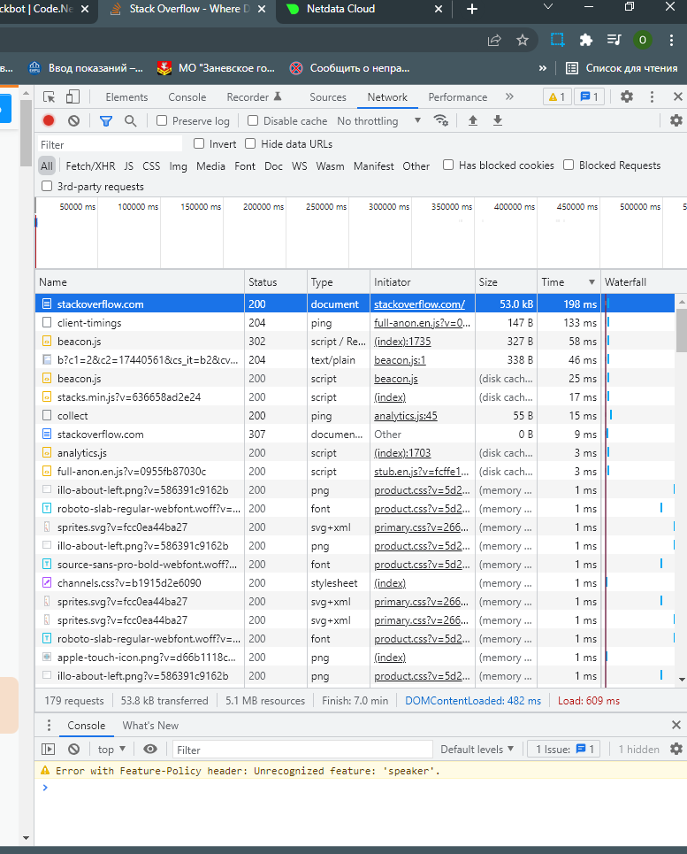

# Домашнее задание к занятию "3.6. Компьютерные сети, лекция 1"

1. Работа c HTTP через телнет.
- Подключитесь утилитой телнет к сайту stackoverflow.com
`telnet stackoverflow.com 80`
- отправьте HTTP запрос
```bash
GET /questions HTTP/1.0
HOST: stackoverflow.com
[press enter]
[press enter]
```
- В ответе укажите полученный HTTP код, что он означает?

```
HTTP/1.1 301 Moved Permanently. Говорит на о том, что запрашиваемый ресурс окончательно перемещен
по адресу указанному в заголовках location: https://stackoverflow.com/questions

```
2. Повторите задание 1 в браузере, используя консоль разработчика F12.
- откройте вкладку `Network`
- отправьте запрос http://stackoverflow.com
- найдите первый ответ HTTP сервера, откройте вкладку `Headers`
- укажите в ответе полученный HTTP код.
```
Status Code: 307 Internal Redirect
```
- проверьте время загрузки страницы,
 ```
Load: 1.22 s
```
какой запрос обрабатывался дольше всего?
```
Request URL: https://stackoverflow.com/
Request Method: GET
Status Code: 200 

Request Header: 
:method: GET
:path: /
:scheme: https

Time 198 ms
```

- приложите скриншот консоли браузера в ответ.

<p align="center">
  
</p>

3. Какой IP адрес у вас в интернете?

```
curl 2ip.ru
91.190.86.125

```
4. Какому провайдеру принадлежит ваш IP адрес? Какой автономной системе AS? Воспользуйтесь утилитой `whois`

```
whois -h whois.ripe.net 91.190.86.125

netname:        SMART-NET-EX-START-CUSTOMERS
descr:          Smart Telecom Company
```

5. Через какие сети проходит пакет, отправленный с вашего компьютера на адрес 8.8.8.8? Через какие AS? Воспользуйтесь утилитой `traceroute`

```
 traceroute -An 8.8.8.8
traceroute to 8.8.8.8 (8.8.8.8), 30 hops max, 60 byte packets
 1  172.16.0.1 [*]  0.973 ms  1.079 ms  0.908 ms
 2  91.190.86.1 [AS31376]  1.014 ms  0.983 ms  0.953 ms
 3  185.42.63.62 [AS31376]  0.921 ms  1.182 ms  1.153 ms
 4  217.119.16.193 [AS31376]  29.792 ms  29.759 ms  29.729 ms
 5  217.119.25.93 [AS31376]  1.416 ms  1.637 ms  1.608 ms
 6  * * *
 7  74.125.244.129 [AS15169]  2.769 ms  2.728 ms 209.85.240.254 [AS15169]  1.060 ms
 8  74.125.244.133 [AS15169]  1.723 ms 74.125.244.132 [AS15169]  1.986 ms 74.125.244.180 [AS15169]  1.677 ms
 9  72.14.232.84 [AS15169]  1.653 ms 72.14.232.85 [AS15169]  8.978 ms  8.953 ms
10  142.251.61.219 [AS15169]  6.465 ms 142.251.51.187 [AS15169]  5.320 ms 72.14.236.73 [AS15169]  6.979 ms
11  172.253.79.115 [AS15169]  5.221 ms 216.239.56.101 [AS15169]  5.521 ms 142.250.238.181 [AS15169]  5.489 ms
12  * * *
13  * * *
14  * * *
15  * * *
16  * * *
17  * * *
18  * * *
19  * * *
20  8.8.8.8 [AS15169]  4.684 ms  4.855 ms *

```
6. Повторите задание 5 в утилите `mtr`. 

```
ORO.nord.ru (172.16.22.179)                                                                                                               2022-02-23T15:58:27+0300
Keys:  Help   Display mode   Restart statistics   Order of fields   quit
                                                                                                                          Packets               Pings
 Host                                                                                                                   Loss%   Snt   Last   Avg  Best  Wrst StDev
 1. AS???    172.16.0.1                                                                                                  0.0%    40    0.7   0.8   0.4   5.1   0.7
 2. AS31376  91.190.86.1                                                                                                 0.0%    40    0.8   0.9   0.5   2.9   0.5
 3. AS31376  185.42.63.62                                                                                                0.0%    40    1.3   2.5   0.8  29.4   6.0
 4. AS31376  217.119.16.193                                                                                              0.0%    40    1.2   3.0   1.0  50.5   8.2
 5. AS31376  217.119.25.93                                                                                               0.0%    40    1.4   1.5   1.1   2.3   0.3
 6. AS15169  172.253.76.91                                                                                               0.0%    40    1.4   1.7   1.2   4.4   0.7
 7. AS15169  74.125.244.180                                                                                              0.0%    40    1.4   2.3   1.2  28.3   4.2
 8. AS15169  72.14.232.85                                                                                                0.0%    40    2.6   5.4   1.6 114.3  17.9
 9. AS15169  142.251.51.187                                                                                             10.0%    40    5.2   7.9   4.8  54.0   8.6
10. AS15169  172.253.70.51                                                                                               0.0%    39    5.9   6.4   5.7   8.3   0.6
11. ???
12. ???
13. ???
14. ???
15. ???
16. ???
17. AS15169  8.8.8.8                                                                                                    92.3%    39    5.0   4.9   4.8   5.0   0.1

```
На каком участке наибольшая задержка - delay?
```
8. AS15169  72.14.232.85                                                                                                0.0%    40    2.6   5.4   1.6 114.3  17.9

 whois -h whois.radb.net AS15169
aut-num:    AS15169
as-name:    Google
descr:      Google, Inc
import:     from AS-ANY   accept ANY AND NOT {0.0.0.0/0}
export:     to AS-ANY   announce AS-GOOGLE AND NOT {0.0.0.0/0}
import:     from AS1273   accept ANY
import:     from AS3356   accept ANY
import:     from AS6453   accept ANY
admin-c:    Google Network Engineering
tech-c:     Google Network Engineering
notify:     noc@google.com
mnt-by:     MAINT-AS15169
changed:    arin-contact@google.com 20190626
source:     RADB

```

7. Какие DNS сервера отвечают за доменное имя dns.google? Какие A записи? воспользуйтесь утилитой `dig`

```
dig NS dns.google

; <<>> DiG 9.11.26-RedHat-9.11.26-3.el8 <<>> NS dns.google
;; global options: +cmd
;; Got answer:
;; ->>HEADER<<- opcode: QUERY, status: NOERROR, id: 10806
;; flags: qr rd ra; QUERY: 1, ANSWER: 4, AUTHORITY: 0, ADDITIONAL: 9

;; OPT PSEUDOSECTION:
; EDNS: version: 0, flags:; udp: 4000
;; QUESTION SECTION:
;dns.google.                    IN      NS

;; ANSWER SECTION:
dns.google.             21371   IN      NS      ns2.zdns.google.
dns.google.             21371   IN      NS      ns3.zdns.google.
dns.google.             21371   IN      NS      ns4.zdns.google.
dns.google.             21371   IN      NS      ns1.zdns.google.

;; ADDITIONAL SECTION:
ns2.zdns.google.        21470   IN      A       216.239.34.114
ns3.zdns.google.        17832   IN      A       216.239.36.114
ns4.zdns.google.        21470   IN      A       216.239.38.114
ns1.zdns.google.        20772   IN      A       216.239.32.114

```

8. Проверьте PTR записи для IP адресов из задания 7. Какое доменное имя привязано к IP? воспользуйтесь утилитой `dig`

```
dig -x 216.239.32.114 +noall +answer
114.32.239.216.in-addr.arpa. 21389 IN   PTR     ns1.zdns.google.
...
114.34.239.216.in-addr.arpa. 21600 IN   PTR     ns2.zdns.google.
```

В качестве ответов на вопросы можно приложите лог выполнения команд в консоли или скриншот полученных результатов.

---

## Как сдавать задания

Обязательными к выполнению являются задачи без указания звездочки. Их выполнение необходимо для получения зачета и диплома о профессиональной переподготовке.

Задачи со звездочкой (*) являются дополнительными задачами и/или задачами повышенной сложности. Они не являются обязательными к выполнению, но помогут вам глубже понять тему.

Домашнее задание выполните в файле readme.md в github репозитории. В личном кабинете отправьте на проверку ссылку на .md-файл в вашем репозитории.

Также вы можете выполнить задание в [Google Docs](https://docs.google.com/document/u/0/?tgif=d) и отправить в личном кабинете на проверку ссылку на ваш документ.
Название файла Google Docs должно содержать номер лекции и фамилию студента. Пример названия: "1.1. Введение в DevOps — Сусанна Алиева".

Если необходимо прикрепить дополнительные ссылки, просто добавьте их в свой Google Docs.

Перед тем как выслать ссылку, убедитесь, что ее содержимое не является приватным (открыто на комментирование всем, у кого есть ссылка), иначе преподаватель не сможет проверить работу. Чтобы это проверить, откройте ссылку в браузере в режиме инкогнито.

[Как предоставить доступ к файлам и папкам на Google Диске](https://support.google.com/docs/answer/2494822?hl=ru&co=GENIE.Platform%3DDesktop)

[Как запустить chrome в режиме инкогнито ](https://support.google.com/chrome/answer/95464?co=GENIE.Platform%3DDesktop&hl=ru)

[Как запустить  Safari в режиме инкогнито ](https://support.apple.com/ru-ru/guide/safari/ibrw1069/mac)

Любые вопросы по решению задач задавайте в чате учебной группы.

---

